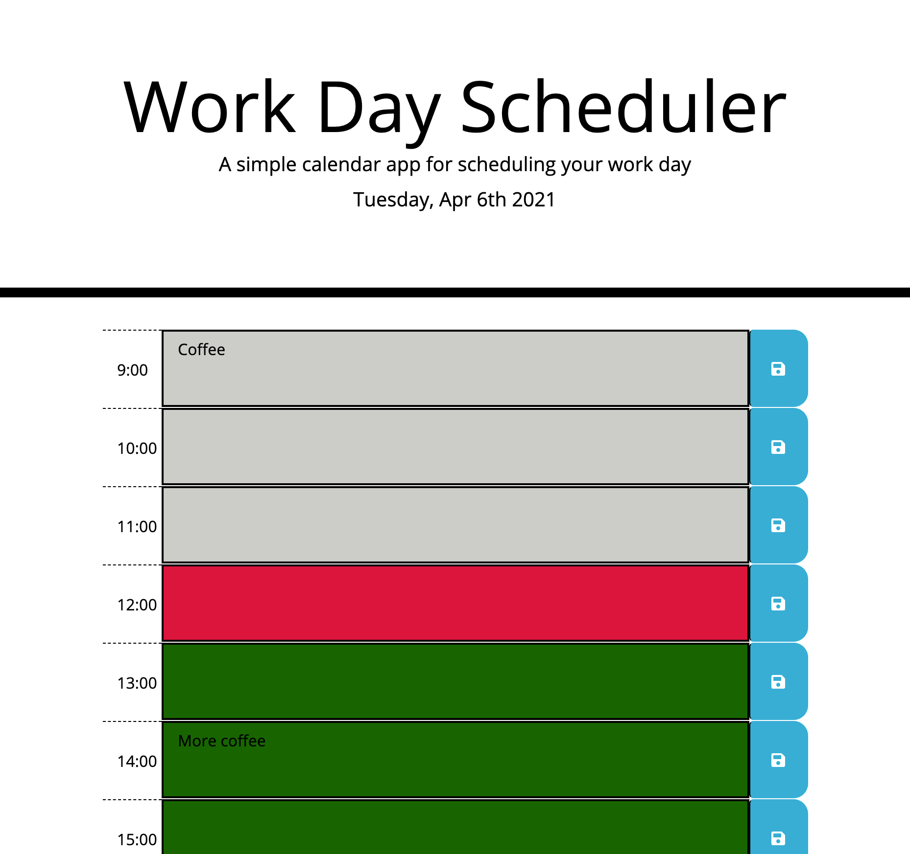

# 05 Third-Party APIs: Work Day Scheduler 
## Description

For this project I created a calendar application that allows a user to save events for each hour of the day by modifying the start code. 

When the planner is opened the current day is displayed at the top of the calendar. 

Timeblocks are presented that represent standard business hours. They are color coded: 
- grey = past event/time
- red = current time 
- green = future event/time

When the timeblocks are clicked into, the user can enter an event. Once the save button is clicked the text is saved into local storage. When the page is refreshed the saved events persist. 

## Usage
 

[Link to deployed application](https://harmane4.github.io/Work-Day-Scheduler/)

## Credits

Websites used to create application: 

[jQuery text() method](https://www.w3schools.com/jquery/html_text.asp)

[jQuery API Documentation](https://api.jquery.com/)

## License 
[MIT](https://choosealicense.com/licenses/mit/)

